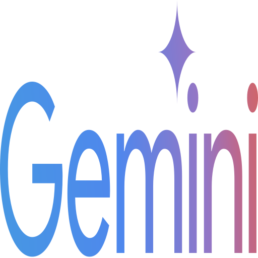

  

  # Antigravity CLI Add-on for Home Assistant
  
  **The ultimate AI agent terminal designed for seamless vibecoding across any device.**

 

Antigravity CLI Add-on integrates a powerful AI agent directly into your Home Assistant environment. With deep access to the Home Assistant Supervisor API and your domotics, this terminal acts as your central command for writing code, executing tasks, and managing your smart home.

What makes this add-on special is its **zero-friction mobile experience**. You can start coding a complex project on your PC, grab your phone, and seamlessly continue vibecoding on the couch with a custom mobile-first UI.

---

## ✨ Key Features

- 📱 **Built for Mobile Vibecoding**: A distraction-free UI wrapper around `ttyd` completely tailored for touch screens. Say goodbye to wonky scrolling, weird keyboard overlays, or unreadable text.
- 🔄 **Seamless Device Transitions**: Powered by `dtach` and `script`, your terminal session remains persistent. You can start a process on your PC, switch to your tablet, and open it on your phone without losing your command history or interrupting running tasks.
- ⌨️ **Mobile-Optimized Macros & Controls**: Features a built-in virtual keypad specifically designed for terminal usage on mobile:
  - **High-Precision D-Pad**: Vectorized SVG arrow keys that render perfectly centered on any iOS or Android device.
  - **Terminal Essentials**: Dedicated `Esc` and `Tab` keys.
  - **Macro Actions**: Instantly execute common commands like `/new` (new chat) and `/quota` (check usage) with a single tap.
- 🖼️ **Direct Image Uploads**: Need to give the AI visual context? Tap the "Upload Image" button on your phone, select a photo, and it is instantly uploaded to an ephemeral secure container directory (`/tmp/uploads`) and the path is automatically typed into your terminal prompt.
- 🔒 **Deep & Secure Integration**: Automatically bridges the AI with your Home Assistant Supervisor Token in a secure sandbox.
- 🎨 **Beautiful Aesthetics**: Complete with a dynamic mesh-gradient footer that feels right at home on modern devices.

---

## 🚀 Installation Guide

Since this is a custom Home Assistant Add-on, you need to add this repository to your Supervisor.

### Step 1: Add the Repository
1. Open your Home Assistant web interface.
2. Navigate to **Settings** > **Add-ons** > **Add-on Store** (bottom right button).
3. Click the three dots (⋮) in the top right corner and select **Repositories**.
4. Paste the URL of this GitHub repository and click **Add**.

### Step 2: Install the Add-on
1. Close the Repositories modal.
2. Scroll down to find the newly added **Antigravity CLI** section, or search for it.
3. Click on the **Antigravity CLI** add-on and click **Install**.

### Step 3: Configuration & Start
1. Once installed, toggle on **Show in sidebar** for easy access.
2. Click **Start**.
3. *Optional*: Check the **Log** tab to ensure the add-on started correctly.
4. Click on the **Antigravity** icon in your sidebar to open the terminal.

---

## 🛡️ Security & Privacy

This add-on is designed with security in mind:
- **No Path Traversal**: Image uploads are strictly sanitized (`os.path.basename`) and securely stored in an ephemeral, non-persistent `/tmp/uploads` directory.
- **Auto-Purging**: The upload directory is automatically wiped every time the add-on restarts to prevent storage bloat and ensure privacy.
- **Sandboxed Execution**: Runs fully inside the Home Assistant Docker supervisor ecosystem.

---

  <i>Supercharge your smart home with AI-driven vibecoding.</i>

